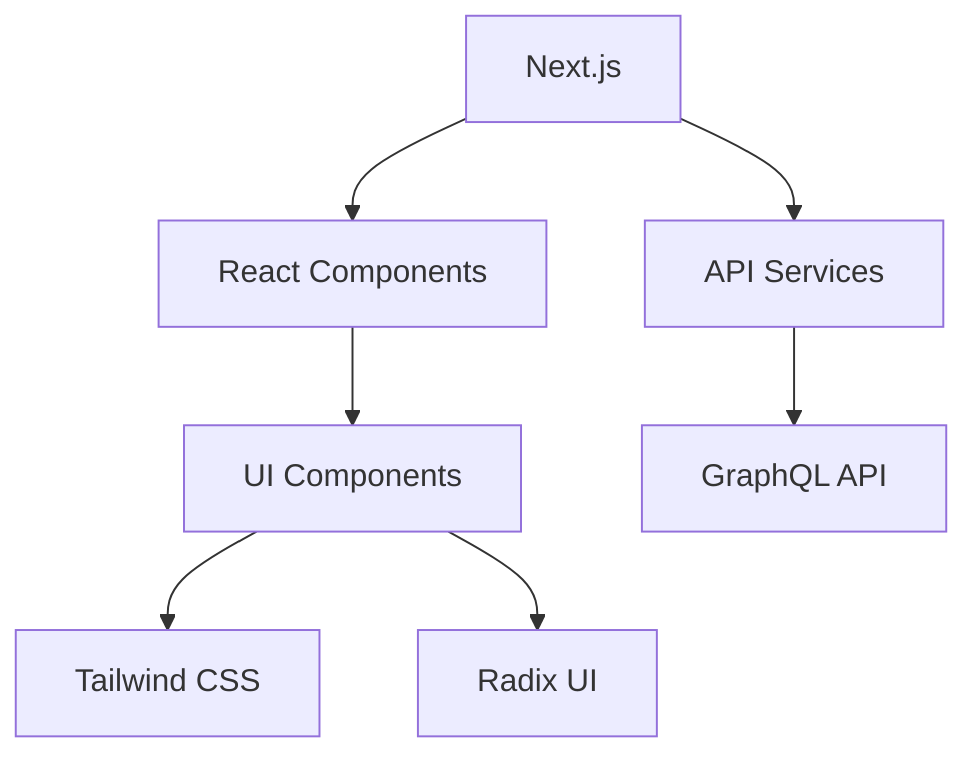

# Documentation Technique du Projet `graphql`

## 📋 Table des Matières

1. [Vue d'ensemble du projet](#vue-densemble-du-projet)
2. [Architecture technique](#architecture-technique)
3. [Instructions de configuration](#instructions-de-configuration)
4. [Dépendances et prérequis](#dépendances-et-prérequis)
5. [Configuration](#configuration)
6. [Documentation de l'API](#documentation-de-lapi)
7. [Cas d'utilisation courants](#cas-dutilisation-courants)
8. [Guide de dépannage](#guide-de-dépannage)
9. [Considérations de sécurité](#considérations-de-sécurité)
10. [Optimisations de performance](#optimisations-de-performance)
11. [Lignes directrices pour les tests](#lignes-directrices-pour-les-tests)
12. [Processus de déploiement](#processus-de-déploiement)
13. [Procédures de maintenance](#procédures-de-maintenance)
14. [Informations de contact](#informations-de-contact)

---

## 📚 Vue d'ensemble du projet

Le projet `graphql` est une application Next.js qui utilise React pour créer une interface utilisateur interactive et performante. L'application inclut plusieurs composants UI réutilisables et personnalisables, tels que des palettes de commandes, des menus contextuels, des dialogues, et des éléments de statut. Le projet utilise des bibliothèques comme `cmdk`, `Radix UI`, et `Tailwind CSS` pour assurer une expérience utilisateur fluide et cohérente.

---

## 🏗️ Architecture technique

### 📦 Structure du projet

Le projet est structuré en plusieurs modules principaux :

- **`src/components/ui/`**: Contient les composants UI réutilisables.
- **`src/app/`**: Contient les pages et les composants de l'application.
- **`src/lib/`**: Contient les utilitaires et les services.
- **`public/`**: Contient les fichiers statiques comme les SVG.

### 📐 Modèles de conception

- **Modèle MVC (Model-View-Controller)**: Utilisé pour séparer les préoccupations et faciliter la maintenance.
- **Composants réutilisables**: Utilisation de composants React pour créer des interfaces utilisateur modulaires et réutilisables.

### 🔍 Décisions architecturales

- **Utilisation de Next.js**: Pour le rendu côté serveur et les fonctionnalités de routage.
- **Tailwind CSS**: Pour un style rapide et cohérent.
- **Radix UI**: Pour des composants UI accessibles et personnalisables.

### 📦 Diagramme de l'architecture



---

## 🛠️ Instructions de configuration

### 📦 Prérequis

- **Node.js**: Version 14 ou supérieure.
- **npm, yarn, pnpm, ou bun**: Gestionnaires de paquets.

### 📦 Installation

```bash
# Utiliser npm
npm install

# Utiliser yarn
yarn install

# Utiliser pnpm
pnpm install

# Utiliser bun
bun install
```

### 🚀 Lancement du serveur de développement

```bash
# Utiliser npm
npm run dev

# Utiliser yarn
yarn dev

# Utiliser pnpm
pnpm dev

# Utiliser bun
bun dev
```

---

## 📦 Dépendances et prérequis

### 📦 Dépendances principales

| **Nom**                | **Version** | **Description**                                                                 |
|------------------------|-------------|-----------------------------------------------------------------------------|
| `next`                 | ^13.0.0     | Framework React pour le rendu côté serveur.                                |
| `react`                | ^18.2.0     | Bibliothèque JavaScript pour la construction d'interfaces utilisateur.   |
| `react-dom`           | ^18.2.0     | Bibliothèque pour le rendu des composants React dans le DOM.             |
| `tailwindcss`          | ^3.2.0      | Framework CSS utilitaire pour le style rapide et cohérent.                |
| `radix-ui`             | ^1.0.0      | Composants UI accessibles et personnalisables.                             |
| `cmdk`                 | ^0.1.0      | Bibliothèque pour les palettes de commandes.                               |
| `next-themes`          | ^0.2.0      | Gestion des thèmes pour Next.js.                                         |
| `lucide-react`         | ^0.1.0      | Bibliothèque d'icônes.                                                   |
| `react-hook-form`      | ^7.30.0     | Gestion des formulaires React.                                           |
| `react-day-picker`     | ^8.0.0      | Sélecteur de date pour React.                                            |
| `react-resizable-panels` | ^0.0.12 | Composants pour des panneaux redimensionnables.                             |
| `react-resizable`      | ^3.0.4      | Composants pour des éléments redimensionnables.                           |
| `react-accordion`      | ^6.0.0      | Composants pour des accordéons.                                           |
| `react-alert-dialog`   | ^6.0.0      | Composants pour des dialogues d'alerte.                                 |
| `react-avatar`         | ^6.0.0      | Composants pour des avatars.                                             |
| `react-checkbox`       | ^6.0.0      | Composants pour des cases à cocher.                                      |
| `react-dropdown-menu`  | ^6.0.0      | Composants pour des menus déroulants.                                     |
| `react-form`           | ^6.0.0      | Composants pour des formulaires.                                         |
| `react-hover-card`     | ^6.0.0      | Composants pour des cartes au survol.                                    |
| `react-input-otp`      | ^6.0.0      | Composants pour des entrées OTP.                                         |
| `react-input`          | ^6.0.0      | Composants pour des entrées.                                              |
| `react-label`          | ^6.0.0      | Composants pour des étiquettes.                                           |
| `react-menubar`        | ^6.0.0      | Composants pour des barres de menu.                                      |
| `react-navigation-menu`| ^6.0.0      | Composants pour des menus de navigation.                                 |
| `react-pagination`     | ^6.0.0      | Composants pour la pagination.                                          |
| `react-popover`        | ^6.0.0      | Composants pour des popovers.                                            |
| `react-progress`       | ^6.0.0      | Composants pour des barres de progression.                                |
| `react-radio-group`     | ^6.0.0      | Composants pour des groupes de boutons radio.                            |
| `react-resizable`      | ^6.0.0      | Composants pour des éléments redimensionnables.                           |
| `react-scroll-area`    | ^6.0.0      | Composants pour des zones de défilement.                                 |
| `react-select`         | ^6.0.0      | Composants pour des sélecteurs.                                         |
| `react-separator`      | ^6.0.0      | Composants pour des séparateurs.                                         |
| `react-slider`         | ^6.0.0      | Composants pour des curseurs.                                            |
| `react-sonner`         | ^6.0.0      | Composants pour des notifications.                                        |
| `react-tabs`           | ^6.0.0      | Composants pour des onglets.                                             |
| `react-textarea`       | ^6.0.0      | Composants pour des zones de texte.                                      |
| `react-switch`         | ^6.0.0      | Composants pour des interrupteurs.                                       |
| `react-table`          | ^6.0.0      | Composants pour des tables.                                             |
| `react-toggle-group`   | ^6.0.0      | Composants pour des groupes de bascules.                                 |
| `react-toggle`         | ^6.0.0      | Composants pour des bascules.                                            |
| `react-tooltip`        | ^6.0.0      | Composants pour des infobulles.                                          |
| `react-use-mobile`     | ^6.0.0      | Hook pour détecter les appareils mobiles.                               |
| `react-utils`          | ^6.0.0      | Utilitaires pour React.                                                  |
| `react-accordion`      | ^6.0.0      | Composants pour des accordéons.                                           |
| `react-alert-dialog`   | ^6.0.0      | Composants pour des dialogues d'alerte.                                 |
| `react-avatar`         | ^6.0.0      | Composants pour des avatars.                                             |
| `react-checkbox`       | ^6.0.0      | Composants pour des cases à cocher.                                      |
| `react-dropdown-menu`  | ^6.0.0      | Composants pour des menus déroulants.                                     |
| `react-form`           | ^6.0.0      | Composants pour des formulaires.                                         |
| `react-hover-card`     | ^6.0.0      | Composants pour des cartes au survol.                                    |
| `react-input-otp`      | ^6.0.0      | Composants pour des entrées OTP.                                         |
| `react-input`          | ^6.0.0      | Composants pour des entrées.                                              |
| `react-label`          | ^6.0.0      | Composants pour des étiquettes.                                           |
| `react-menubar`        | ^6.0.0      | Composants pour des barres de menu.                                      |
| `react-navigation-menu`| ^6.0.0      | Composants pour des menus de navigation.                                 |
| `react-pagination`     | ^6.0.0      | Composants pour la pagination.                                          |
| `react-popover`        | ^6.0.0      | Composants pour des popovers.                                            |
| `react-progress`       | ^6.0.0      | Composants pour des barres de progression.                                |
| `react-radio-group`     | ^6.0.0      | Composants pour des groupes de boutons radio.                            |
| `react-resizable`      | ^6.0.0      | Composants pour des éléments redimensionnables.                           |
| `react-scroll-area`    | ^6.0.0      | Composants pour des zones de défilement.                                 |
| `react-select`         | ^6.0.0      | Composants pour des sélecteurs.                                         |
| `react-separator`      | ^6.0.0      | Composants pour des séparateurs.                                         |
| `react-slider`         | ^6.0.0      | Composants pour des curseurs.                                            |
| `react-sonner`         | ^6.0.0      | Composants pour des notifications.                                        |
| `react-tabs`           | ^6.0.0      | Composants pour des onglets.                                             |
| `react-textarea`       | ^6.0.0      | Composants pour des zones de texte.                                      |
| `react-switch`         | ^6.0.0      | Composants pour des interrupteurs.                                       |
| `react-table`          | ^6.0.0      | Composants pour des tables.                                             |
| `react-toggle-group`   | ^6.0.0      | Composants pour des groupes de bascules.                                 |
| `react-toggle`         | ^6.0.0      | Composants pour des bascules.                                            |
| `react-tooltip`        | ^6.0.0      | Composants pour des infobulles.                                          |
| `react-use-mobile`     | ^6.0.0      | Hook pour détecter les appareils mobiles.                               |
| `react-utils`          | ^6.0.0      | Utilitaires pour React.                                                  |

### 📦 Dépendances de développement

| **Nom**                | **Version** | **Description**                                                                 |
|------------------------|-------------|-----------------------------------------------------------------------------|
| `eslint`               | ^8.20.0     | Outils de linting pour JavaScript et TypeScript.                              |
| `typescript`           | ^4.7.4      | Langage de typage pour JavaScript.                                           |
| `next/font`            | ^13.0.0     | Optimisation des polices pour Next.js.                                       |
| `postcss`              | ^8.4.14     | Outils de transformation CSS.                                                  |
| `tailwindcss`          | ^3.2.0      | Framework CSS utilitaire.                                                    |
| `next-themes`          | ^0.2.0      | Gestion des thèmes pour Next.js.                                             |
| `lucide-react`         | ^0.1.0      | Bibliothèque d'icônes.                                                       |
| `react-hook-form`      | ^7.30.0     | Gestion des formulaires React.                                               |
| `react-day-picker`     | ^8.0.0      | Sélecteur de date pour React.                                                |
| `react-resizable-panels` | ^0.0.12 | Composants pour des panneaux redimensionnables.                             |
| `react-resizable`      | ^3.0.4      | Composants pour des éléments redimensionnables.                               |
| `react-accordion`      | ^6.0.0      | Composants pour des accordéons.                                               |
| `react-alert-dialog`   | ^6.0.0      | Composants pour des dialogues d'alerte.                                     |
| `react-avatar`         | ^6.0.0      | Composants pour des avatars.                                                 |
| `react-checkbox`       | ^6.0.0      | Composants pour des cases à cocher.                                          |
| `react-dropdown-menu`  | ^6.0.0      | Composants pour des menus déroulants.                                       |
| `react-form`           | ^6.0.0      | Composants pour des formulaires.                                             |
| `react-hover-card`     | ^6.0.0      | Composants pour des cartes au survol.                                        |
| `react-input-otp`      | ^6.0.0      | Composants pour des entrées OTP.                                             |
| `react-input`          | ^6.0.0      | Composants pour des entrées.                                                 |
| `react-label`          | ^6.0.0      | Composants pour des étiquettes.                                              |
| `react-menubar`        | ^6.0.0      | Composants pour des barres de menu.                                          |
| `react-navigation-menu`| ^6.0.0      | Composants pour des menus de navigation.                                   |
| `react-pagination`     | ^6.0.0      | Composants pour la pagination.                                              |
| `react-popover`        | ^6.0.0      | Composants pour des popovers.                                                |
| `react-progress`       | ^6.0.0      | Composants pour des barres de progression.                                  |
| `react-radio-group`     | ^6.0.0      | Composants pour des groupes de boutons radio.                                |
| `react-resizable`      | ^6.0.0      | Composants pour des éléments redimensionnables.                               |
| `react-scroll-area`    | ^6.0.0      | Composants pour des zones de défilement.                                     |
| `react-select`         | ^6.0.0      | Composants pour des sélecteurs.                                             |
| `react-separator`      | ^6.0.0      | Composants pour des séparateurs.                                             |
| `react-slider`         | ^6.0.0      | Composants pour des curseurs.                                                |
| `react-sonner`         | ^6.0.0      | Composants pour des notifications.                                          |
| `react-tabs`           | ^6.0.0      | Composants pour des onglets.                                                 |
| `react-textarea`       | ^6.0.0      | Composants pour des zones de texte.                                         |
| `react-switch`         | ^6.0.0      | Composants pour des interrupteurs.                                           |
| `react-table`          | ^6.0.0      | Composants pour des tables.                                                  |
| `react-toggle-group`   | ^6.0.0      | Composants pour des groupes de bascules.                                     |
| `react-toggle`         | ^6.0.0      | Composants pour des bascules.                                                |
| `react-tooltip`        | ^6.0.0      | Composants pour des infobulles.                                             |
| `react-use-mobile`     | ^6.0.0      | Hook pour détecter les appareils mobiles.                                   |
| `react-utils`          | ^6.0.0      | Utilitaires pour React.                                                    |

---

## 🔧 Configuration

### 📝 Configuration de l'environnement

Le fichier `next.config.ts` permet de configurer Next.js. Voici un exemple de configuration :

```typescript
// next.config.ts
import { NextConfig } from 'next';

const nextConfig: NextConfig = {
  reactStrictMode: true,
  swcMinify: true,
  // Ajoutez vos configurations ici
};

export default nextConfig;
```

### 📝 Configuration de Tailwind CSS

Le fichier `tailwind.config.ts` configure Tailwind CSS pour le projet :

```typescript
// tailwind.config.ts
import { Config } from 'tailwindcss';

const config: Config = {
  content: [
    './src/**/*.{js,ts,jsx,tsx}',
  ],
  theme: {
    extend: {
      colors: {
        primary: 'var(--color-primary)',
        secondary: 'var(--color-secondary)',
      },
    },
  },
  plugins: [],
};

export default config;
```

### 📝 Configuration de PostCSS

Le fichier `postcss.config.mjs` configure PostCSS pour intégrer Tailwind CSS :

```javascript
// postcss.config.mjs
module.exports = {
  plugins: {
    tailwindcss: {},
    autoprefixer: {},
  },
};
```

### 📝 Configuration de TypeScript

Le fichier `tsconfig.json` configure TypeScript pour le projet :

```json
{
  "compilerOptions": {
    "target": "es2017",
    "lib": ["dom", "esnext"],
    "strict": true,
    "module": "esnext",
    "moduleResolution": "bundler",
    "jsx": "preserve",
    "incremental": true,
    "plugins": [
      {
        "name": "next"
      }
    ],
    "paths": {
      "@/*": ["./src/*"]
    },
    "include": ["next-env.d.ts", "**/*.ts", "**/*.tsx"],
    "exclude": ["node_modules"]
  }
}
```

---

## 📚 Documentation de l'API

### 📦 API Services

Le fichier `src/app/services/apiService.ts` contient les fonctions pour interagir avec l'API GraphQL :

```typescript
// src/app/services/apiService.ts
import { GraphQLClient, gql } from 'graphql-request';

const client = new GraphQLClient('https://zone01normandie.org/api/graphql-engine/v1/graphql', {
  headers: {
    authorization: `Bearer ${getToken()}`,
  },
});

export const fetchData = async (query: string) => {
  const data = await client.request(query);
  return data;
};

export const fetchUserData = async () => {
  const query = gql`
    query {
      user {
        id
        name
        email
      }
    }
  `;
  return fetchData(query);
};

export const fetchProjectsData = async () => {
  const query = gql`
    query {
      projects {
        id
        name
        description
      }
    }
  `;
  return fetchData(query);
};

export const fetchCursusData = async () => {
  const query = gql`
    query {
      cursus {
        id
        name
        description
      }
    }
  `;
  return fetchData(query);
};
```

### 📦 Exemple d'utilisation

```typescript
// Exemple d'utilisation des API services
import { fetchUserData, fetchProjectsData, fetchCursusData } from './apiService';

const userData = await fetchUserData();
const projectsData = await fetchProjectsData();
const cursusData = await fetchCursusData();

console.log(userData, projectsData, cursusData);
```

---

## 📝 Cas d'utilisation courants

### 📦 Connexion utilisateur

Le fichier `src/app/auth/login/page.tsx` gère la connexion utilisateur :

```typescript
// src/app/auth/login/page.tsx
import { useAuth } from '@/context/AuthContext';
import { useState } from 'react';

const LoginPage = () => {
  const { login } = useAuth();
  const [email, setEmail] = useState('');
  const [password, setPassword] = useState('');
  const [error, setError] = useState('');

  const handleLogin = async () => {
    try {
      await login(email, password);
    } catch (err) {
      setError('Invalid email or password');
    }
  };

  return (
    <div>
      <h1>Login</h1>
      <input type="email" value={email} onChange={(e) => setEmail(e.target.value)} />
      <input type="password" value={password} onChange={(e) => setPassword(e.target.value)} />
      <button onClick={handleLogin}>Login</button>
      {error && <p>{error}</p>}
    </div>
  );
};

export default LoginPage;
```

### 📦 Affichage du profil utilisateur

Le fichier `src/app/profile/page.tsx` affiche les informations du profil utilisateur :

```typescript
// src/app/profile/page.tsx
import { useUser } from '@/context/userContext';
import { useEffect } from 'react';

const ProfilePage = () => {
  const { user, fetchUserData } = useUser();

  useEffect(() => {
    fetchUserData();
  }, []);

  return (
    <div>
      <h1>Profile</h1>
      {user ? (
        <div>
          <p>Name: {user.name}</p>
          <p>Email: {user.email}</p>
        </div>
      ) : (
        <p>Loading...</p>
      )}
    </div>
  );
};

export default ProfilePage;
```

---

## 🛠️ Guide de dépannage

### 📦 Problèmes courants

| **Problème**                  | **Solution**                                                                 |
|--------------------------------|-----------------------------------------------------------------------------|
| **Erreur de connexion API**    | Vérifiez les en-têtes d'autorisation et les tokens.                         |
| **Problèmes de rendu**          | Assurez-vous que les composants sont correctement importés et utilisés.     |
| **Erreurs de type TypeScript** | Vérifiez les types et les interfaces définis dans `context/type.ts`.      |
| **Problèmes de style**          | Assurez-vous que Tailwind CSS est correctement configuré et importé.         |
| **Problèmes de performance**    | Utilisez des outils comme Lighthouse pour identifier et résoudre les problèmes. |

### 📦 Exemple de dépannage

```typescript
// Exemple de dépannage pour les erreurs de connexion API
try {
  const userData = await fetchUserData();
  console.log(userData);
} catch (error) {
  console.error('Erreur de connexion API:', error);
}
```

---

## 🔒 Considérations de sécurité

### 📦 Meilleures pratiques

- **Utilisez des tokens JWT sécurisés** pour l'authentification.
- **Validez et nettoyez les entrées utilisateur** pour éviter les injections SQL et XSS.
- **Utilisez HTTPS** pour sécuriser les communications entre le client et le serveur.
- **Gérez les erreurs de manière sécurisée** pour éviter les fuites d'informations sensibles.

### 📦 Exemple de sécurité

```typescript
// Exemple de gestion sécurisée des erreurs
try {
  const userData = await fetchUserData();
  console.log(userData);
} catch (error) {
  console.error('Erreur de connexion API:', error.message);
}
```

---

## 🚀 Optimisations de performance

### 📦 Conseils de performance

- **Utilisez le rendu côté serveur (SSR)** pour améliorer les temps de chargement.
- **Optimisez les images** avec des formats modernes comme WebP.
- **Utilisez le lazy loading** pour les composants et les images.
- **Minimisez les requêtes réseau** en utilisant des caches et des optimisations de requêtes.

### 📦 Exemple d'optimisation

```typescript
// Exemple d'utilisation du lazy loading
import dynamic from 'next/dynamic';

const LazyComponent = dynamic(() => import('../components/LazyComponent'), {
  ssr: false,
});

const Page = () => {
  return (
    <div>
      <LazyComponent />
    </div>
  );
};

export default Page;
```

---

## 📝 Lignes directrices pour les tests

### 📦 Types de tests

- **Tests unitaires**: Pour vérifier le bon fonctionnement des composants individuels.
- **Tests d'intégration**: Pour vérifier l'interaction entre les composants.
- **Tests end-to-end (E2E)**: Pour vérifier le flux complet de l'application.

### 📦 Exemple de test unitaire

```typescript
// Exemple de test unitaire avec Jest
import { render, screen } from '@testing-library/react';
import ProfilePage from '@/app/profile/page';

test('renders profile page', () => {
  render(<ProfilePage />);
  const linkElement = screen.getByText(/Profile/i);
  expect(linkElement).toBeInTheDocument();
});
```

### 📦 Exemple de test d'intégration

```typescript
// Exemple de test d'intégration avec Jest
import { render, screen } from '@testing-library/react';
import { useUser } from '@/context/userContext';
import ProfilePage from '@/app/profile/page';

jest.mock('@/context/userContext');

test('renders user data', async () => {
  (useUser as jest.Mock).mockReturnValue({
    user: { name: 'John Doe', email: 'john@example.com' },
    fetchUserData: jest.fn(),
  });

  render(<ProfilePage />);
  const nameElement = await screen.findByText(/John Doe/i);
  const emailElement = await screen.findByText(/john@example.com/i);

  expect(nameElement).toBeInTheDocument();
  expect(emailElement).toBeInTheDocument();
});
```

---

## 🚀 Processus de déploiement

### 📦 Déploiement sur Vercel

1. **Connectez votre dépôt GitHub** à Vercel.
2. **Configurez les paramètres de déploiement** dans Vercel.
3. **Déployez l'application** en utilisant la commande `vercel`.

### 📦 Exemple de déploiement

```bash
# Déploiement sur Vercel
vercel
```

---

## 🛠️ Procédures de maintenance

### 📦 Mise à jour des dépendances

1. **Vérifiez les mises à jour disponibles** avec `npm outdated` ou `yarn outdated`.
2. **Mettez à jour les dépendances** avec `npm update` ou `yarn upgrade`.
3. **Testez l'application** pour vous assurer que tout fonctionne correctement.

### 📦 Exemple de mise à jour

```bash
# Mise à jour des dépendances
npm update
```

### 📦 Surveillance

- **Utilisez des outils de surveillance** comme New Relic ou Datadog pour surveiller les performances et les erreurs.
- **Configurez des alertes** pour être informé des problèmes potentiels.

### 📦 Exemple de surveillance

```bash
# Exemple de configuration de surveillance avec New Relic
newrelic install
```

### 📦 Sauvegarde et récupération

- **Effectuez des sauvegardes régulières** de la base de données et des fichiers de configuration.
- **Testez les procédures de récupération** pour vous assurer qu'elles fonctionnent correctement.

### 📦 Exemple de sauvegarde

```bash
# Exemple de sauvegarde de la base de données
pg_dump -U username -F t database_name > backup_file.tar
```

### 📦 Tâches de maintenance

| **Tâche**                | **Fréquence** | **Description**                                                                 |
|--------------------------|---------------|-----------------------------------------------------------------------------|
| Mise à jour des dépendances | Mensuelle     | Mettre à jour les dépendances pour corriger les bugs et améliorer les performances. |
| Surveillance des performances | Hebdomadaire | Surveiller les performances et les erreurs pour identifier les problèmes potentiels. |
| Sauvegarde de la base de données | Hebdomadaire | Effectuer des sauvegardes régulières de la base de données.                   |
| Tests de récupération     | Mensuelle     | Tester les procédures de récupération pour s'assurer qu'elles fonctionnent correctement. |

---

## 📞 Informations de contact

Pour toute question ou assistance, veuillez contacter :

- **Nom**: [Votre Nom]
- **Email**: [votre-email@example.com]
- **Téléphone**: [Votre Numéro de Téléphone]

---

## 📝 Lignes directrices pour les contributions

Pour contribuer à ce projet, veuillez suivre les étapes suivantes :

1. **Forkez le dépôt** sur GitHub.
2. **Créez une branche** pour votre fonctionnalité ou correction de bug.
3. **Commitez vos modifications** avec des messages de commit clairs.
4. **Ouvrez une pull request** pour fusionner vos modifications.

### 📦 Exemple de contribution

```bash
# Forkez le dépôt
git clone https://github.com/votre-utilisateur/graphql.git
cd graphql

# Créez une branche pour votre fonctionnalité
git checkout -b feature/nouvelle-fonctionnalité

# Commitez vos modifications
git add .
git commit -m "Ajout de la nouvelle fonctionnalité"

# Ouvrez une pull request
```

---

Merci d'avoir lu cette documentation. Si vous avez des questions ou des suggestions, n'hésitez pas à nous contacter. 😊
